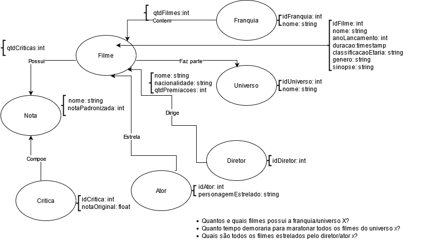

# Lab07 - Modelo Lógico para Banco de Dados de Grafos

# Aluno
* `221329`: `Maicon Gabriel de Oliveira`

## Modelo Lógico do Banco de Dados de Grafos
> 

## Perguntas de Pesquisa/Análise

> Liste aqui as três perguntas de pesquisa/análise
> * Quantos e quais filmes possui a franquia/universo X?
> * Quanto tempo demoraria para maratonar todos os filmes do universo X?
> * Quais são todos os filmes estrelados pelo ator/diretor X?
